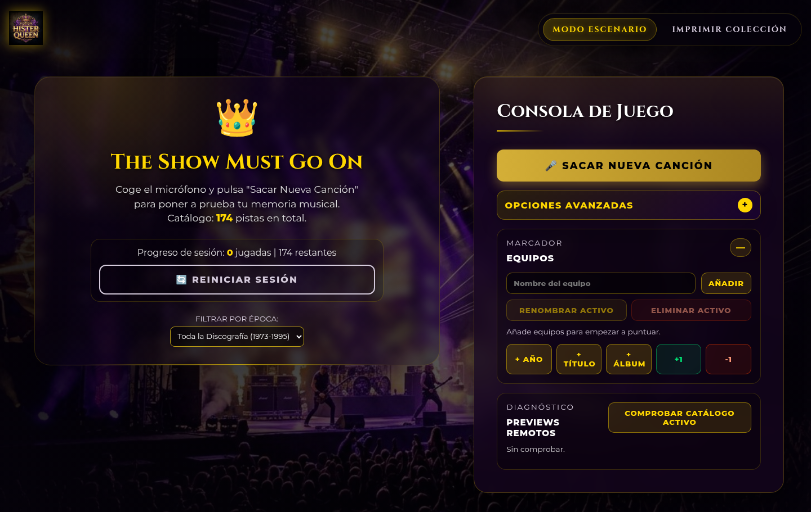
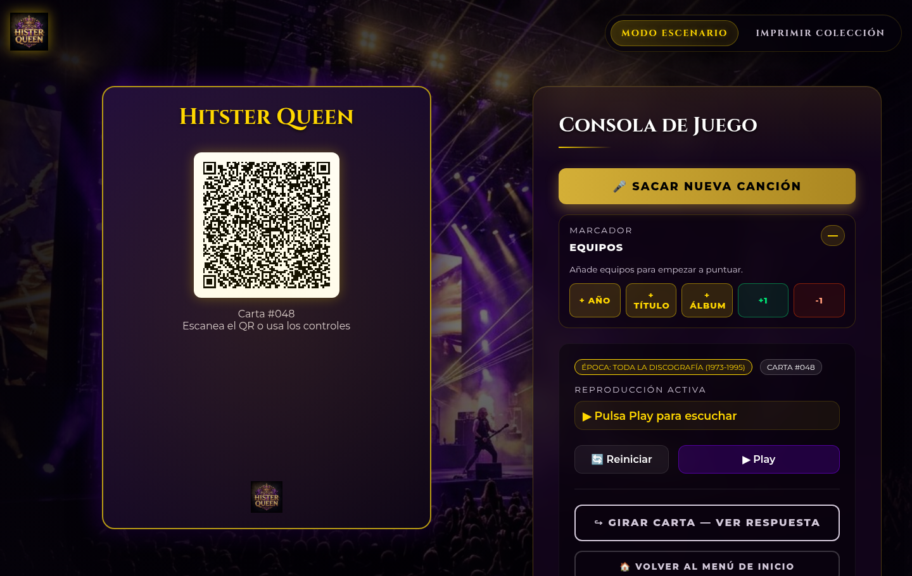

# Hister: Queen Edition

Juego web estático inspirado en Hitster para jugar con canciones de Queen. La aplicación selecciona canciones aleatorias, reproduce previews de audio, muestra una carta con QR y permite revelar año, título y álbum.

## Capturas

### Configuración inicial



### Partida en curso



## Características

- Catálogo de canciones organizado por año y álbum.
- Reproducción de previews remotos de Apple/iTunes.
- Carta interactiva con QR y reverso con la respuesta.
- Filtros por época.
- Historial de sesión sin spoiler: se actualiza al revelar o al pasar a la siguiente canción.
- Sin repeticiones dentro del catálogo activo durante la sesión.
- Final de partida real al agotar el catálogo, con tarjeta especial de cierre.
- Persistencia del estado de sesión y del final de partida tras recargar.
- Reinicio limpio de la sesión al volver a empezar después de completar el catálogo.
- Manejo más robusto de errores de audio y tiempos de espera de previews remotos.
- Descarte automático en la sesión de cartas cuyo preview no se puede cargar.
- Cartas imprimibles con QR o fallback visible si el generador QR no está disponible.
- Cartas imprimibles numeradas para reproducir una carta física desde la pantalla principal si falla el QR.
- Colección imprimible rediseñada para pantalla e impresión, sin mostrar spoilers de canción.
- Generación progresiva de la colección imprimible con animación, contador y bloqueo temporal del botón de imprimir hasta que los QR están listos.
- Reglas de puntuación configurables para año, título y álbum.
- Marcador de equipos persistente con suma rápida por año, título, álbum o puntos manuales.
- Renombrado y eliminación del equipo activo desde el marcador.
- Filtros de dificultad por hits, cortes de álbum, instrumentales/soundtrack y modo difícil.
- Playlist manual por álbum, tamaño de partida aleatorio o lista exacta de números de carta.
- Opciones avanzadas colapsadas por defecto para mantener limpia la pantalla de inicio.
- Modo presentador para evitar revelar la respuesta al tocar accidentalmente la carta.
- Importación y exportación de sesión en JSON.
- Diagnóstico desde la interfaz para comprobar previews remotos del catálogo activo.
- Soporte PWA básico: instalación en móvil/escritorio y caché local de la app, imágenes y scripts.
- Fondo de concierto aleatorio entre dos imágenes locales.
- Diseño responsive para escritorio y móvil, con panel de historial estable, menú superior flotante, foco accesible y marcador visualmente diferenciado.
- Separación clara entre configuración inicial y controles durante la partida: diagnóstico, opciones avanzadas y gestión de equipos solo aparecen antes de iniciar.

## Estructura

- `index.html`: estructura de la aplicación.
- `styles.css`: estilos visuales, impresión y responsive.
- `js/app.js`: orquestación principal del juego, audio, navegación, historial y fondo aleatorio.
- `js/catalog.js`: utilidades y validación del catálogo.
- `js/session.js`: saneado de sesiones importadas y normalización de reglas, equipos y playlist.
- `js/playlist.js`: construcción de partidas filtradas, selección aleatoria con semilla y modo manual por carta.
- `js/qr-renderer.js`: generación de QR y fallback si falla la librería externa.
- `js/diagnostics.js`: comprobación concurrente y cancelable de previews remotos.
- `js/print-cards.js`: generación de cartas imprimibles.
- `data.js`: catálogo de canciones, dificultad explícita y URLs de preview.
- `scripts/validate-catalog.js`: validación local del catálogo.
- `scripts/validate-previews.js`: validación opcional de disponibilidad de previews.
- `manifest.webmanifest`: metadatos de instalación PWA.
- `sw.js`: caché offline parcial de recursos locales.
- `CHANGELOG.md`: registro de cambios por versión.
- `queen_logo.jpg`: imagen decorativa del proyecto.
- `queen_concert_bg.jpg`: fondo principal.
- `queen_concert_bg_alt.jpg`: fondo alternativo original/procedural.

## Uso local

No requiere compilación ni instalación de dependencias. Al ser una web estática, puedes abrir `index.html` directamente o servir la carpeta con un servidor local:

```bash
python3 -m http.server 8000
```

Después abre `http://localhost:8000`.

Para revisar PWA, manifest y service worker sin errores de consola, usa siempre servidor local o GitHub Pages. Si abres `index.html` como `file://`, el navegador bloquea esas capacidades por seguridad.

## Validación

Puedes comprobar sintaxis JavaScript y consistencia básica del catálogo con:

```bash
npm test
```

La validación local comprueba campos obligatorios, dificultad (`hits`, `deep` o `instrumental`), claves duplicadas, URLs duplicadas y que los previews apunten al dominio esperado de Apple/iTunes. No descarga todos los audios; sirve para detectar errores de datos antes de publicar.

Para comprobar disponibilidad real de los previews remotos:

```bash
npm run validate:previews
```

Este comando hace peticiones de red a Apple/iTunes y puede tardar o fallar por conectividad externa. Para probar solo una muestra:

```bash
npm run validate:previews -- --limit=10
```

## Estado de la sesión

La aplicación guarda automáticamente en `localStorage`:

- Canciones ya usadas dentro del catálogo activo.
- Historial de canciones reveladas.
- Filtro por época seleccionado.
- Filtros de dificultad, álbum, tamaño de partida y lista manual.
- Semilla de playlist para que una partida corta conserve la misma selección aleatoria al recargar.
- Reglas de puntuación.
- Equipos y marcador.
- Modo presentador.
- Estado de partida completada si ya no quedan canciones disponibles en el filtro actual.

Para empezar desde cero, usa `Reiniciar Sesión`.

También puedes usar `Exportar sesión` para guardar progreso, reglas, playlist y marcador en JSON, o `Importar sesión` para restaurarlos en otro navegador.

Las listas manuales de cartas tienen prioridad sobre dificultad, álbum y tamaño de partida. Si introduces `1, 5, 10-20`, la partida se construye con esos números exactos de carta.

Si la partida ya terminó y vuelves a la pantalla principal, al empezar de nuevo el juego reinicia la sesión completa para limpiar las cartas usadas y reconstruir correctamente la cara frontal con su QR.

## Robustez ante fallos externos

La app depende de dos recursos externos:

- Previews de audio remotos de Apple/iTunes.
- Librería `QRCode.js` cargada desde CDN con SRI.

Si falla un preview, la consola de juego muestra mensajes claros para reintentar o cambiar de canción. Si el generador QR no está disponible, el juego sigue funcionando y muestra un fallback visible con la URL del preview.

Si una carta tiene un preview roto o inaccesible, esa carta se descarta automáticamente durante la sesión actual para que la partida pueda continuar sin bloqueos.

## Colección imprimible

La sección `Imprimir Colección` está pensada para mostrar todas las cartas de forma compacta y aprovechando mejor el ancho disponible en cada dispositivo.

- En pantalla, las tarjetas mantienen una estética coherente con el juego.
- En impresión, se simplifican para que salgan limpias y legibles en papel.
- No muestran título, año ni álbum reales, para evitar spoilers antes de jugar.
- Cada tarjeta muestra un número de carta. Si un QR falla, introduce ese número en `Usar carta impresa` dentro del modo escenario.
- La colección se genera por bloques para evitar congelar la interfaz. Mientras se preparan los QR, la pantalla muestra progreso y el botón de imprimir permanece desactivado.

## Flujo visual de partida

La pantalla inicial concentra las decisiones de configuración: filtros, dificultad, reglas, importación/exportación, diagnóstico de previews y gestión de equipos. Al sacar una canción, la consola oculta esos bloques para reducir ruido y deja solo los controles necesarios durante la partida: reproducción, revelar respuesta, volver al inicio, historial y marcador.

Los botones de puntuación aplican puntos al equipo activo. `+ Año`, `+ Título` y `+ Álbum` usan los valores definidos en las reglas configurables; `+1` y `-1` sirven para ajustes manuales rápidos.

## PWA y uso sin conexión

La aplicación registra un service worker cuando se sirve por `http://localhost` o HTTPS. Esto cachea HTML, CSS, JavaScript e imágenes locales para abrir la app aunque la conexión falle.

Los previews de audio y `QRCode.js` siguen siendo externos; si no hay conexión, la app puede abrirse, pero el audio remoto y la primera carga del generador QR pueden no estar disponibles.

Cuando cambien archivos cacheados, actualiza `CACHE_NAME` en `sw.js` para forzar que los navegadores instalen la versión nueva.

## Publicación en GitHub Pages

1. Crea un repositorio público en GitHub.
2. Sube estos archivos al repositorio.
3. En GitHub, ve a `Settings > Pages`.
4. Selecciona `Deploy from a branch`, rama `main`, carpeta `/ (root)`.
5. Guarda los cambios y espera a que GitHub publique la página.

## Notas legales

Este proyecto es un tributo fan sin ánimo de lucro. Queen, sus canciones, nombres, marcas y cualquier material musical pertenecen a sus titulares correspondientes. Las URLs de audio apuntan a previews públicos de Apple/iTunes y no incluyen archivos de audio alojados en este repositorio.

El código propio del proyecto se publica bajo licencia MIT. La licencia no concede derechos sobre marcas, música, nombres de artistas ni material de terceros.
